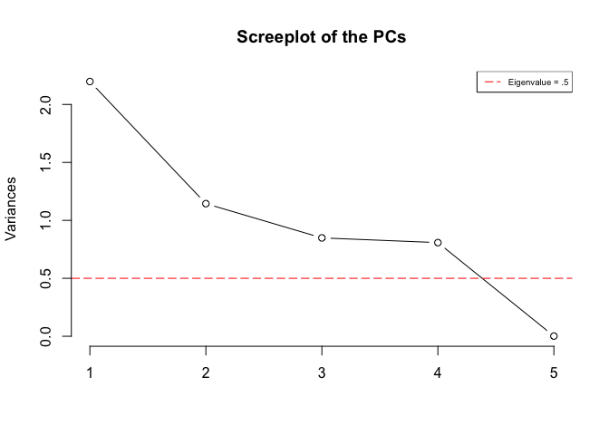
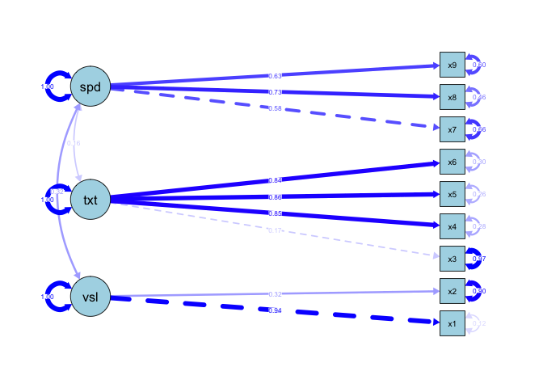

final
================
jason grahn
3/16/2019

Problem 1
=========

Show your reason completely and clearly, including all necessary commands and outputs, as well as interpretations/conclusions.

``` r
S <- matrix(c(5, 0, 0, 0, 9, 0, 0, 0, 8), byrow = TRUE, nrow = 3, ncol = 3)
S
```

    ##      [,1] [,2] [,3]
    ## [1,]    5    0    0
    ## [2,]    0    9    0
    ## [3,]    0    0    8

(a) Find the eigenvalues and eigenvectors of S.
-----------------------------------------------

``` r
# 2. Calculate eigenvectors/eigenvalues
res.eig <- (eigen(S))
res.eig
```

    ## eigen() decomposition
    ## $values
    ## [1] 9 8 5
    ## 
    ## $vectors
    ##      [,1] [,2] [,3]
    ## [1,]    0    0    1
    ## [2,]    1    0    0
    ## [3,]    0    1    0

(b) Show the percent of variance explained.
-------------------------------------------

``` r
R.prop <- round(res.eig$values/(sum(res.eig$values)), 4)
R.prop
```

    ## [1] 0.4091 0.3636 0.2273

``` r
round(sum(R.prop), 2)
```

    ## [1] 1

``` r
0.4091 + 0.3636
```

    ## [1] 0.7727

(c) Decide how many components to retain.
-----------------------------------------

Utilizing only the first factor accounts for 40% of variance, which isn't enough. Using the first two provides 77% of variance explained, which would be acceptible for any business setting, but doesn't seem sufficient for our causes. I would use all three factors I would keep all three components for this analysis as the third factor contains nearly 23% of explained variance, which is significant enough to include; and all three add up to 100% of explained variance.

Problem 2:
==========

The correlation matrix given below arises from the scores of 220 boys in six school subjects: (1) French, (2) English, (3) history, (4) arithmetic, (5) algebra, and (6) geometry.

Obtain principal component loadings for three factors.
------------------------------------------------------

``` r
p2 = matrix(c(1, 0.44, 0.41, 0.29, 0.33, 0.25, 0.44, 1, 0.35, 0.35, 0.32, 0.33,
              0.41, 0.35, 1, 0.16, 0.19, 0.18, 0.29, 0.35, 0.16, 1, 0.59, 0.47,
              0.33, 0.32, 0.19, 0.59, 1, 0.46, 0.25, 0.33, 0.18, 0.47, 0.46, 1),
            nrow=6, ncol=6, byrow = TRUE) 
colnames(p2) <- c("French", "English", "History", "Arithmetic", "Algebra", "Geometry")
rownames(p2) <- c("French", "English", "History", "Arithmetic", "Algebra", "Geometry")
#p2

fit <- principal(p2, 
                 nfactors = 3, 
                 rotate = 'none', 
                 covar = FALSE)
fit
```

    ## Principal Components Analysis
    ## Call: principal(r = p2, nfactors = 3, rotate = "none", covar = FALSE)
    ## Standardized loadings (pattern matrix) based upon correlation matrix
    ##             PC1   PC2   PC3   h2    u2 com
    ## French     0.66  0.44 -0.16 0.66 0.339 1.9
    ## English    0.69  0.29 -0.53 0.84 0.160 2.3
    ## History    0.52  0.64  0.52 0.95 0.055 2.9
    ## Arithmetic 0.74 -0.42  0.02 0.72 0.285 1.6
    ## Algebra    0.74 -0.37  0.13 0.71 0.293 1.5
    ## Geometry   0.68 -0.35  0.14 0.60 0.396 1.6
    ## 
    ##                        PC1  PC2  PC3
    ## SS loadings           2.73 1.13 0.62
    ## Proportion Var        0.45 0.19 0.10
    ## Cumulative Var        0.45 0.64 0.75
    ## Proportion Explained  0.61 0.25 0.14
    ## Cumulative Proportion 0.61 0.86 1.00
    ## 
    ## Mean item complexity =  2
    ## Test of the hypothesis that 3 components are sufficient.
    ## 
    ## The root mean square of the residuals (RMSR) is  0.11 
    ## 
    ## Fit based upon off diagonal values = 0.92

`PC1` shows us that all variables are positively strong. `PC2` shows us that History is strongly positive, while the others start to degrade in weakness. `PC3` shows us that History maintains that strong positive relationship, and English has a strong negative relationship, while the rest of the variables seem insignificant.

Problem 3:
==========

For the Foodstuff Contents data set below, column names are “Food Energy Protein Fat Calcium Iron”:

(a) Discuss your choice of the number of factors.
-------------------------------------------------

(b) Obtain principal component loadings.
----------------------------------------

(c) Calculate percent of variance explained for each factor, plot the factor scores using appropriate plot(s), and decide how many components to retain.
--------------------------------------------------------------------------------------------------------------------------------------------------------

Show your work completely and clearly, including all necessary commands and outputs, as well as interpretations/conclusions.

``` r
Problem3_data <- read_csv(here::here("final/Problem3-data.csv"))
head(Problem3_data,3)
```

    ## # A tibble: 3 x 6
    ##   Food  Energy Protein   Fat Calcium  Iron
    ##   <chr>  <dbl>   <dbl> <dbl>   <dbl> <dbl>
    ## 1 BB       340      20    28       9   2.6
    ## 2 HR       245      21    17       9   2.7
    ## 3 BR       420      15    39       7   2

``` r
fit <- principal(Problem3_data[2:6], 
                 nfactors = 4, 
                 rotate = 'none', 
                 covar = FALSE)
fit
```

    ## Principal Components Analysis
    ## Call: principal(r = Problem3_data[2:6], nfactors = 4, rotate = "none", 
    ##     covar = FALSE)
    ## Standardized loadings (pattern matrix) based upon correlation matrix
    ##           PC1   PC2   PC3  PC4 h2      u2 com
    ## Energy   0.97  0.09  0.14 0.18  1 8.1e-04 1.1
    ## Protein  0.22 -0.74 -0.43 0.47  1 1.7e-05 2.6
    ## Fat      0.95  0.22  0.20 0.12  1 7.8e-04 1.2
    ## Calcium -0.53 -0.01  0.60 0.60  1 1.6e-08 3.0
    ## Iron    -0.18  0.74 -0.50 0.42  1 1.7e-07 2.6
    ## 
    ##                        PC1  PC2  PC3  PC4
    ## SS loadings           2.20 1.14 0.85 0.81
    ## Proportion Var        0.44 0.23 0.17 0.16
    ## Cumulative Var        0.44 0.67 0.84 1.00
    ## Proportion Explained  0.44 0.23 0.17 0.16
    ## Cumulative Proportion 0.44 0.67 0.84 1.00
    ## 
    ## Mean item complexity =  2.1
    ## Test of the hypothesis that 4 components are sufficient.
    ## 
    ## The root mean square of the residuals (RMSR) is  0 
    ##  with the empirical chi square  0  with prob <  NA 
    ## 
    ## Fit based upon off diagonal values = 1

``` r
# scale, center, and apply PCA 
probe.pca <- prcomp(Problem3_data[2:6],
                    center = TRUE,
                    scale. = TRUE) 
                    
screeplot(probe.pca, type = "l", main = "Screeplot of the PCs")
abline(h = 0.5, 
       col="red", 
       lty=5)
legend("topright", 
       legend=c("Eigenvalue = .5"),
       col=c("red"), 
       lty=5, 
       cex=0.6)
```



Problem 4:
==========

The data below measures in five variables in comparison of normal patients and diabetics:

-   x1 : glucose intolerance
-   x2 : insulin response to oral glucose
-   x3 : insulin resistance
-   y1 : relative weight
-   y2 : fasting plasma glucose

(a) Find the canonical correlation between (y1, y2) and (x1, x2, x3).
---------------------------------------------------------------------

``` r
Problem4_data <- read_csv(here::here("final/problem4-data.csv"))
head(Problem4_data,3)
```

    ## # A tibble: 3 x 6
    ##   patient    y1    y2    x1    x2    x3
    ##     <dbl> <dbl> <dbl> <dbl> <dbl> <dbl>
    ## 1       1  0.81    80   356   124    55
    ## 2       2  0.95    97   289   117    76
    ## 3       3  0.94   105   319   143   105

``` r
normals <- Problem4_data %>% select(y1, y2)
diabetics <- Problem4_data %>% select(x1, x2, x3)

cca_output <- cca(normals, diabetics)
cca_output$corr
```

    ##       CV 1       CV 2 
    ## 0.34192472 0.05719007

(b) Test the significance of each canonical correlation.
--------------------------------------------------------

``` r
F.test.cca(cca_output)
```

    ## 
    ##  F Test for Canonical Correlations (Rao's F Approximation)
    ## 
    ##         Corr       F  Num df Den df Pr(>F)
    ## CV 1 0.34192 0.43922 6.00000     40 0.8482
    ## CV 2 0.05719      NA 2.00000     NA     NA

Problem 5:
==========

The data consists of mental ability test scores of seventh- and eighth-grade children from two different schools (Pasteur and Grant-White). In our version of the dataset, only 9 out of the original 26 tests are included. A CFA model that is often proposed for these 9 variables consists of three latent variables (or factors), each with three indicators:

-   a visual factor measured by 2 variables: x1 and x2
-   a textual factor measured by 4 variables: x3, x4, x5 and x6
-   a speed factor measured by 3 variables: x7, x8 and x9
-   a visual factor and a textual factor have zero correlation

(a) Please draw a figure contains a graphical representation of the three-factor model.
---------------------------------------------------------------------------------------

``` r
pgwmodel <- ' visual  =~ x1 + x2
              textual =~ x3 + x4 + x5 + x6 
              speed   =~ x7 + x8 + x9 
              visual  ~~ 0*textual ' 

fit <- sem(pgwmodel, 
           data = HolzingerSwineford1939)

semPaths(fit, 
         "std",
         title = "FALSE",
         edge.color = "blue",
         color = "light blue",
         rotation = 2,
         layout = "tree2")
```



(b) Please write out the corresponding syntax for specifying this model.
------------------------------------------------------------------------

**v**i**s**u**a**l* =~ *x*1 + *x*2 **t**e**x**t**u**a**l* =~ *x*3 + *x*4 + *x*5 + *x*6
**s**p**e**e**d* =~ *x*7 + *x*8 + *x*9 **v**i**s**u**a**l* ~~ 0*t**e**x**t**u**a**l*

Problem 6:
==========

Make a conclusion for this class DA 410, make sure you include the following aspects: \#\# (a) How many models you have learnt, use 3 to 5 sentences to explain each of them. \#\# (b) Which one really impressed you when you learnt and why \#\# (c) Which one is your favorite one and why \#\# (d) Select two models out, make a comparison. Show the differences and similarities between them. \#\# (e) If you will build up a project to solve some real problem using one of them, which one you would like to you, and what kind of project you will like to build. (200 words)
