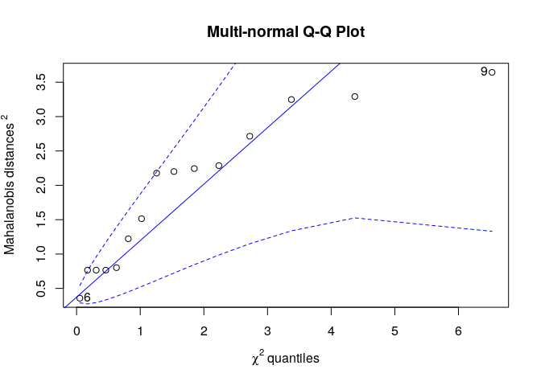
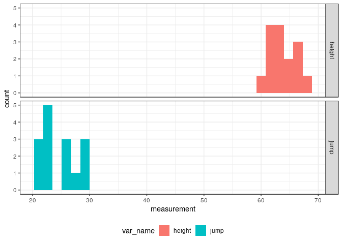
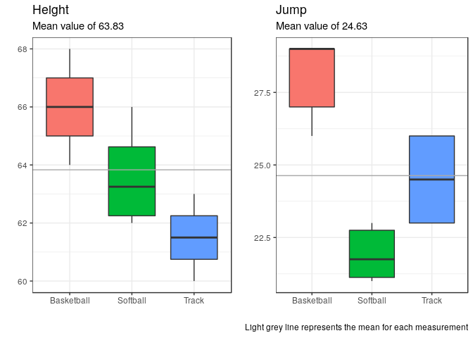

da410\_project2
================
Jason Grahn
1/23/2019

Part 1:
=======

The problem statement
---------------------

Use Hotelling’s T^2 test to test for a difference in the mean score vector of the boys and the mean vector of the girls. Make sure you include clear command lines and relevant output/results with hypotheses, test result(s) and conclusion(s)/interpretation(s).

The data
--------

Download testscoredata.txt and read it in R

``` r
scores <- 
  readr::read_table2(file = here::here("/project2/testscoredata.txt"),
                   col_names = TRUE) %>% 
  mutate(subject = factor(subject),
         sex = factor(sex))

head(scores,5)
```

    ## # A tibble: 5 x 4
    ##   subject  math reading sex  
    ##   <fct>   <dbl>   <dbl> <fct>
    ## 1 1        83.2    79.7 boy  
    ## 2 2       103.    101.  boy  
    ## 3 3        81.6    80.5 boy  
    ## 4 4        88.2    84.6 boy  
    ## 5 5        81.5    76.5 boy

The hypothesis
--------------

> *H*<sub>0</sub>: The mean scores between sexes is equal ( *μ*<sub>*o*</sub> = *μ*<sub>1</sub>).

> *H*<sub>*a*</sub>: The mean scores between sexes is not equal ( *μ*<sub>*o*</sub> ≠ *μ*<sub>1</sub>).

``` r
#sample covariance matrix
scores.S <- scores %>% 
  select(math, reading) %>% 
  var()

round(scores.S,3)
```

    ##           math reading
    ## math    26.909  25.672
    ## reading 25.672  27.335

``` r
#build the manova binding
scores.manova <- stats::manova(cbind(math, reading) ~ sex, scores)
scores.manova
```

    ## Call:
    ##    stats::manova(cbind(math, reading) ~ sex, scores)
    ## 
    ## Terms:
    ##                       sex Residuals
    ## resp 1             19.976  1621.466
    ## resp 2             3.7684 1663.6793
    ## Deg. of Freedom         1        60
    ## 
    ## Residual standard errors: 5.198502 5.265737
    ## Estimated effects may be unbalanced

The test
--------

``` r
#use the HL method to test results.
tidy.score.hotel <- broom::tidy(scores.manova, 
                              test = "Hotelling-Lawley",
                              intercept = FALSE)
```

The result:
-----------

``` r
tidy.score.hotel
```

    ## # A tibble: 2 x 7
    ##   term         df     hl statistic num.df den.df   p.value
    ##   <chr>     <dbl>  <dbl>     <dbl>  <dbl>  <dbl>     <dbl>
    ## 1 sex           1  0.306      9.02      2     59  0.000381
    ## 2 Residuals    60 NA         NA        NA     NA NA

The conclusion
--------------

With a *p* − *v**a**l**u**e* of 3.805224610^{-4}, we can reject *H*<sub>0</sub> and conclude that the mean vectors between the sexes is not equal.

------------------------------------------------------------------------

------------------------------------------------------------------------

------------------------------------------------------------------------

Part 2:
=======

The problem statement
---------------------

Suppose we have gathered the following data on female athletes in three sports. The measurements we have made are the athletes' heights and vertical jumps, both in inches. The data are listed as (height, jump) as follows:

    Basketball Players: (66, 27), (65, 29), (68, 26), (64, 29), (67, 29)
    Track Athletes:     (63, 23), (61, 26), (62, 23), (60, 26)
    Softball Players:   (62, 23), (65, 21), (63, 21), (62, 23), (63.5, 22), (66, 21.5)

A
-

Use R to conduct the MANOVA F-test using Wilks' Lambda to test for a difference in (height, jump) mean vectors across the three sports. Make sure you include clear command lines and relevant output/results with hypotheses, test result(s) and conclusion(s)/interpretation(s)

### The data

Download testscoredata.txt and read it in R

``` r
#imput data
sport  <- as.factor(c('B','B','B','B','B','T','T','T','T','S','S','S','S','S','S'))
height <- c(66,65,68,64,67,63,61,62,60,62,65,63,62,63.5,66)
jump   <- c(27,29,26,29,29,23,26,23,26,23,21,21,23,22,21.5)

#make a table
sports <- tibble(sport, height, jump) %>% 
  #and give the sports friendly names
  mutate(sport = case_when(sport == "B" ~ "Basketball",
                           sport == "T" ~ "Track",
                           sport == "S" ~ "Softball"))
head(sports, 5)
```

    ## # A tibble: 5 x 3
    ##   sport      height  jump
    ##   <chr>       <dbl> <dbl>
    ## 1 Basketball     66    27
    ## 2 Basketball     65    29
    ## 3 Basketball     68    26
    ## 4 Basketball     64    29
    ## 5 Basketball     67    29

``` r
#making a tidy table for later use
tidy.sports <- sports %>% gather(key = var_name, value = measurement, -sport)
```

The hypothesis
--------------

> *H*<sub>0</sub>: The mean difference between sports is equal ( *μ*<sub>*o*</sub> = *μ*<sub>1</sub>).

> *H*<sub>*a*</sub>: The mean difference between sports is not equal ( *μ*<sub>*o*</sub> ≠ *μ*<sub>1</sub>).

``` r
sports.manova <- stats::manova(cbind(height, jump) ~ sport, sports)
sports.manova
```

    ## Call:
    ##    stats::manova(cbind(height, jump) ~ sport, sports)
    ## 
    ## Terms:
    ##                     sport Residuals
    ## resp 1           45.62500  28.20833
    ## resp 2          101.02500  21.20833
    ## Deg. of Freedom         2        12
    ## 
    ## Residual standard errors: 1.533197 1.329421
    ## Estimated effects may be unbalanced

### The test

``` r
tidy.sports.wilks <- broom::tidy(sports.manova, 
                              test = "Wilks",
                              intercept = FALSE)
```

### The result:

``` r
tidy.sports.wilks
```

    ## # A tibble: 2 x 7
    ##   term         df   wilks statistic num.df den.df      p.value
    ##   <chr>     <dbl>   <dbl>     <dbl>  <dbl>  <dbl>        <dbl>
    ## 1 sport         2  0.0359      23.5      4     22  0.000000112
    ## 2 Residuals    12 NA           NA       NA     NA NA

Wilks' *Λ* score 0.036.

### The conclusion

With a *p* − *v**a**l**u**e* of 1.116880510^{-7}, we can safely reject *H*<sub>0</sub> and conclude that the mean vectors aross the sports are not equal.

B
-

### The assumptions

State the assumptions of your test and check to see whether assumptions are met. Do you believe your inference is valid? Why or why not?

``` r
#one way to check for nomalicy is the qqplot. We'll use RVAideMemoire::mqqnorm for this
RVAideMemoire::mqqnorm(sports %>% select(height, jump))
```



    ## [1] 9 6

While the displayed confidence interval is quite spread, we see most values do reside near the line and can conclude normalicy.

``` r
tidy.sports %>% 
  ggplot(aes(x = measurement)) +
  geom_histogram(aes(fill = var_name)) +
  facet_grid(var_name ~ .) +
  theme_bw() +
  theme(legend.position="bottom")
```



Histograms for either variable indicate we may not have normal distributions. Ideally we would have more samples in order to conduct a thorough analysis.

We assume independence as we do not have evidence of the sampling methodology.

C
-

Use R to examine the sample mean vectors for each group. Make sure you include clear command lines and relevant output/results. Also comment on the differences among the groups in terms of the specific variables.

``` r
# Sample mean vectors for the sports data
xbar.sat <- apply(sports %>% select(height, jump), 2, mean)
xbar.sat
```

    ##   height     jump 
    ## 63.83333 24.63333

``` r
# do some boxplots showing mean distributions
height_box <- sports %>% 
  ggplot(aes(x = sport, y = height, fill = sport)) +
  geom_boxplot() +
  geom_hline(yintercept = xbar.sat[[1]], color = "dark grey") +
  theme_bw() +
  theme(legend.position="none") +
  labs(title = "Height",
       subtitle = "Mean value of 63.83",
       y = "",
       x = "",
       caption = " ")

jump_box <- sports %>% 
  ggplot(aes(x = sport, y = jump, fill = sport)) +
  geom_boxplot() +
  geom_hline(yintercept = xbar.sat[[2]], color = "dark grey") +
  theme_bw() +
  theme(legend.position="none") +
  labs(title = "Jump",
       subtitle = "Mean value of 24.63",
       y = "",
       x = "",
       caption = "Light grey line represents the mean for each measurement")

cowplot::plot_grid(height_box,jump_box)
```



Plotting the sample mean for each measurement on top of boxplots, we clearly see the distributions for each sport in each variable do not overlap. This reinforces the hypothesis test showing rejection of *H*<sub>0</sub>.

``` r
# a quick table of means.
sports %>% 
  group_by(sport) %>% 
  summarize(mean_height = round(mean(height),3),
            mean_jump = round(mean(jump),3)) 
```

    ## # A tibble: 3 x 3
    ##   sport      mean_height mean_jump
    ##   <chr>            <dbl>     <dbl>
    ## 1 Basketball        66        28  
    ## 2 Softball          63.6      21.9
    ## 3 Track             61.5      24.5
