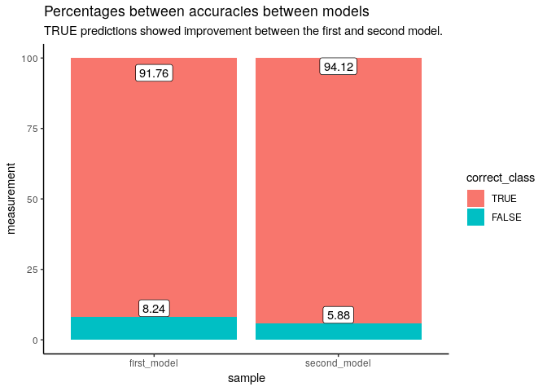

da410\_project3
================
Jason Grahn
1/27/2019

Problem 1.
==========

1. Use admission.csv as a training dataset.
-------------------------------------------

We're going to use `admission.csv` twice, so importing once and calling it good.

``` r
admission <- readr::read_csv(here::here("project3/admission.csv"), 
                             col_types = cols(De = col_factor(levels = c("admit", "border", "notadmit"))))

#plot scatter to look for clustering
admission %>% 
  ggplot(aes(x = GPA, y = GMAT, color = De)) +
  geom_point() +
  theme_classic() +
  theme(legend.position = "bottom")
```


2. Train model using LDA by setting admit/not-admit/border with the same probabilities.
---------------------------------------------------------------------------------------

``` r
model_1 <- lda(formula = De ~ ., 
                        data = admission, 
                        prior = c(1,1,1)/3)

model_1
```

    ## Call:
    ## lda(De ~ ., data = admission, prior = c(1, 1, 1)/3)
    ## 
    ## Prior probabilities of groups:
    ##     admit    border  notadmit 
    ## 0.3333333 0.3333333 0.3333333 
    ## 
    ## Group means:
    ##               GPA     GMAT
    ## admit    3.403871 561.2258
    ## border   2.992692 446.2308
    ## notadmit 2.482500 447.0714
    ## 
    ## Coefficients of linear discriminants:
    ##              LD1         LD2
    ## GPA  5.017202736  1.85401003
    ## GMAT 0.008503148 -0.01448967
    ## 
    ## Proportion of trace:
    ##    LD1    LD2 
    ## 0.9644 0.0356

3. Calculate the misclassfication rate
--------------------------------------

``` r
#apply the model to admissions with predict()
predict_admit <- predict(model_1, # predictions
                data = admissions)

#pull the predictions and
predict_class <- predict_admit$class

#I might want to use that data later, so let's write them back to the table
admission_predictions <- admission %>% 
  mutate(predictions = predict_admit$class,
         LD1 = predict_admit$x[,1],
         LD2 = predict_admit$x[,2])

#back to misclassification
#quick glance of predictions versus actuals
table(predict_class, admission$De)
```

    ##              
    ## predict_class admit border notadmit
    ##      admit       27      1        0
    ##      border       4     25        2
    ##      notadmit     0      0       26

``` r
first_percentages <- admission_predictions %>% 
  mutate(correct_class = factor((De == predictions))) %>% 
  group_by(correct_class) %>% 
  summarise(classified_count = n(), 
            total = nrow(admission_predictions)) %>% 
  mutate(percentage = round(classified_count / total * 100, 2)) 

first_percentages
```

    ## # A tibble: 2 x 4
    ##   correct_class classified_count total percentage
    ##   <fct>                    <int> <int>      <dbl>
    ## 1 FALSE                        7    85       8.24
    ## 2 TRUE                        78    85      91.8

4. Predict students with GPA and SAT score as below.
----------------------------------------------------

``` r
#the values
GPA <- c(3.14, 3.08, 2.08, 3.22)
GMAT <- c(470, 591, 641, 463)
p_student <- as.factor(c("student1", "student2", "student3", "student4"))

#put those in a table
predict_me <- tibble(p_student, GPA, GMAT)

#apply the model and save the output
predict_subgroup <- predict(model_1, # predictions
                            newdata = predict_me)

#incorporate the output into the original table
predict_me_output <- predict_me %>% 
  mutate(predictions = predict_subgroup$class)

predict_me_output
```

    ## # A tibble: 4 x 4
    ##   p_student   GPA  GMAT predictions
    ##   <fct>     <dbl> <dbl> <fct>      
    ## 1 student1   3.14   470 border     
    ## 2 student2   3.08   591 admit      
    ## 3 student3   2.08   641 notadmit   
    ## 4 student4   3.22   463 border

Problem 2.
==========

1. Use admission.csv as a training dataset.
-------------------------------------------

We already input this before, so let's call it again just to show we have it.

``` r
head(admission,5)
```

    ## # A tibble: 5 x 3
    ##     GPA  GMAT De   
    ##   <dbl> <dbl> <fct>
    ## 1  2.96   596 admit
    ## 2  3.14   473 admit
    ## 3  3.22   482 admit
    ## 4  3.29   527 admit
    ## 5  3.69   505 admit

2. Train model using LDA by setting probability of `admit` is 50% while probability of `not admit` is 25% and probability of `border` is 25%.
---------------------------------------------------------------------------------------------------------------------------------------------

``` r
model_2 <- lda(formula = De ~ ., 
                        data = admission, 
                        prior = c(.5,.25,.25))

model_2
```

    ## Call:
    ## lda(De ~ ., data = admission, prior = c(0.5, 0.25, 0.25))
    ## 
    ## Prior probabilities of groups:
    ##    admit   border notadmit 
    ##     0.50     0.25     0.25 
    ## 
    ## Group means:
    ##               GPA     GMAT
    ## admit    3.403871 561.2258
    ## border   2.992692 446.2308
    ## notadmit 2.482500 447.0714
    ## 
    ## Coefficients of linear discriminants:
    ##              LD1        LD2
    ## GPA  4.961868967  1.9973815
    ## GMAT 0.008915905 -0.0142394
    ## 
    ## Proportion of trace:
    ##    LD1    LD2 
    ## 0.9724 0.0276

3. Calculate the misclassfication rate
--------------------------------------

``` r
#apply the model to admissions with predict()
predict_admit_2 <- predict(model_2, # predictions
                data = admissions)

#pull the classificaton predictions into their own frame
predict_class_2 <- predict_admit_2$class

#I might want to use that data later, so let's write these back to the table as the other predictions
admission_predictions <- admission_predictions %>% 
  mutate(predictions_2 = predict_admit_2$class,
         LD1_2 = predict_admit_2$x[,1],
         LD2_2 = predict_admit_2$x[,2])

#back to misclassification
#quick glance of predictions versus actuals
table(predict_class_2, admission$De)
```

    ##                
    ## predict_class_2 admit border notadmit
    ##        admit       29      1        0
    ##        border       2     25        2
    ##        notadmit     0      0       26

``` r
second_percentages <- admission_predictions %>% 
  mutate(correct_class_2 = factor((De == predictions_2))) %>% 
  group_by(correct_class_2) %>% 
  summarise(classified_count = n(), 
            total = nrow(admission_predictions)) %>% 
  mutate(percentage = round(classified_count / total * 100, 2)) 
```

4. Predict students with GPA and SAT score as below.
----------------------------------------------------

``` r
#apply the model and save the output
predict_subgroup_2 <- predict(model_2, # predictions
                            newdata = predict_me)

#incorporate the output into the previous prediction table
predict_me_output <- predict_me_output %>% 
  mutate(predictions_2 = predict_subgroup_2$class)

predict_me_output
```

    ## # A tibble: 4 x 5
    ##   p_student   GPA  GMAT predictions predictions_2
    ##   <fct>     <dbl> <dbl> <fct>       <fct>        
    ## 1 student1   3.14   470 border      border       
    ## 2 student2   3.08   591 admit       admit        
    ## 3 student3   2.08   641 notadmit    notadmit     
    ## 4 student4   3.22   463 border      border

Compare differences of the result from problem1.
------------------------------------------------

``` r
#One way to compare results is to look at the difference in percentages between missclassfied students

# a negative number indicates that the second model was worse than the first. 
# ie; the second model incorrectly predicted a larger count than the first.

#a positive number indicates that the second model was better, that it more accurately predicted the actual
first_percentages$percentage[1] - second_percentages$percentage[1]
```

    ## [1] 2.36

We see that the second model decreased the misclassification rate by 2.36 points; that it accurately predicted the actual better than the first model.

``` r
first_percentages %>% 
  dplyr::select(correct_class, percentage) %>% 
  rename(first_model = percentage) %>% 
  mutate(second_model = (second_percentages$percentage),
         correct_class = factor(correct_class, levels = c(TRUE, FALSE))) %>% 
  gather(key = sample, value = measurement, -correct_class) %>% 
  ggplot(aes(x = sample, y = measurement, label = measurement)) +
 # scale_x_discrete(position = "top") +
  geom_col(aes(fill = correct_class)) +
  theme_classic() + 
  geom_label(vjust = "bottom") +
  labs(title = "Percentages between accuracies between models",
       subtitle = "TRUE predictions showed improvement between the first and second model.")
```



Problem 3.
==========

Explain what is Quadratic Discriminant Analysis (QDA), and use QDA to train the model, discuss if this project can be done better by QDA, why or why not.
---------------------------------------------------------------------------------------------------------------------------------------------------------

`QDA` is:

``` r
model_qda <- MASS::qda(formula = De ~ ., 
                       data = admission, 
                       prior = c(.5,.25,.25))
#apply the QDA model to admissions with predict()
predict_qda <- predict(model_qda, # predictions
                           data = admissions)

#pull the classificaton predictions into their own frame
predict_qda_output <- predict_qda$class

#I might want to use that data later, so let's write these back to the table as the other predictions
admission_predictions <- admission_predictions %>% 
  mutate(predictions_qda = predict_qda_output)

#back to misclassification
#quick glance of predictions versus actuals
#table(predict_qda_output, admission$De)

third_percentages <- admission_predictions %>% 
  mutate(correct_class_3 = factor((De == predictions_qda))) %>% 
  group_by(correct_class_3) %>% 
  summarise(classified_count = n(), 
            total = nrow(admission_predictions)) %>% 
  mutate(percentage = round(classified_count / total * 100, 2)) 

third_percentages
```

    ## # A tibble: 2 x 4
    ##   correct_class_3 classified_count total percentage
    ##   <fct>                      <int> <int>      <dbl>
    ## 1 FALSE                          3    85       3.53
    ## 2 TRUE                          82    85      96.5
