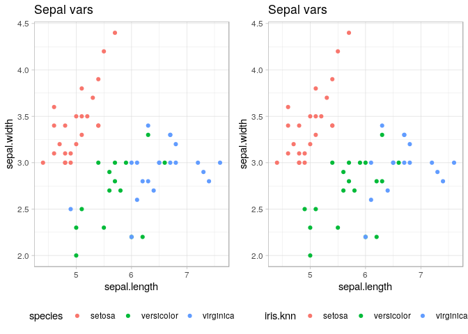
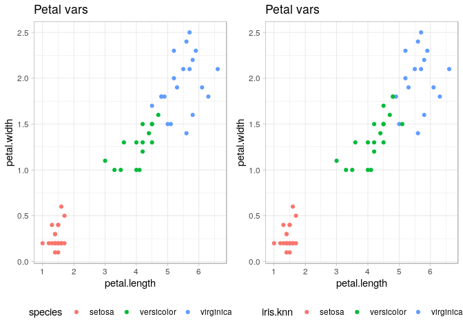
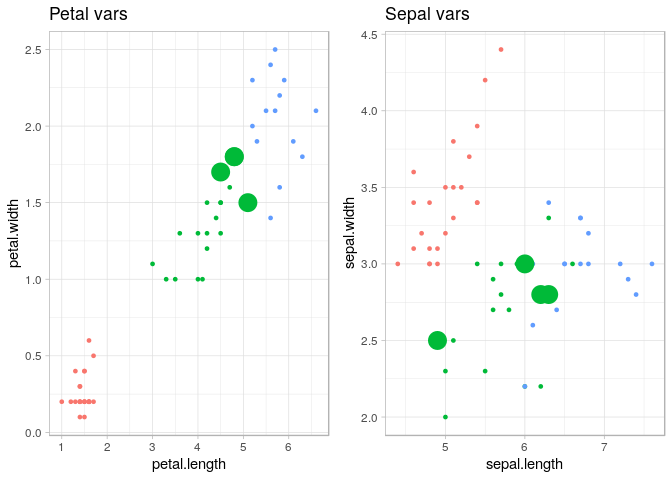

da410\_project4\_grahn
================
Jason Grahn
2/7/2019

Use R built-in function (e.g. knn) to do 9.7 (c), try different k values and find out the best solution.

Do some EDA at the very beginning and make a clean explanation of how and why you choose your final model.

Data Load
=========

``` r
#iris is already loaded but I dont like camelcase headers so lets fix those then show head()
data.table::setnames(iris, tolower(names(iris[1:5])))
head(iris,5)
```

    ##   sepal.length sepal.width petal.length petal.width species
    ## 1          5.1         3.5          1.4         0.2  setosa
    ## 2          4.9         3.0          1.4         0.2  setosa
    ## 3          4.7         3.2          1.3         0.2  setosa
    ## 4          4.6         3.1          1.5         0.2  setosa
    ## 5          5.0         3.6          1.4         0.2  setosa

Summary Statistics of the Iris flower data set
==============================================

``` r
summary(iris)
```

    ##   sepal.length    sepal.width     petal.length    petal.width   
    ##  Min.   :4.300   Min.   :2.000   Min.   :1.000   Min.   :0.100  
    ##  1st Qu.:5.100   1st Qu.:2.800   1st Qu.:1.600   1st Qu.:0.300  
    ##  Median :5.800   Median :3.000   Median :4.350   Median :1.300  
    ##  Mean   :5.843   Mean   :3.057   Mean   :3.758   Mean   :1.199  
    ##  3rd Qu.:6.400   3rd Qu.:3.300   3rd Qu.:5.100   3rd Qu.:1.800  
    ##  Max.   :7.900   Max.   :4.400   Max.   :6.900   Max.   :2.500  
    ##        species  
    ##  setosa    :50  
    ##  versicolor:50  
    ##  virginica :50  
    ##                 
    ##                 
    ## 

Mean and standard deviation within each species
===============================================

``` r
#means
iris %>% group_by(species) %>% 
  summarise(mean(sepal.length),
            mean(sepal.width),
            mean(petal.length),
            mean(petal.width))
```

    ## # A tibble: 3 x 5
    ##   species `mean(sepal.len… `mean(sepal.wid… `mean(petal.len…
    ##   <fct>              <dbl>            <dbl>            <dbl>
    ## 1 setosa              5.01             3.43             1.46
    ## 2 versic…             5.94             2.77             4.26
    ## 3 virgin…             6.59             2.97             5.55
    ## # … with 1 more variable: `mean(petal.width)` <dbl>

``` r
#standard deviations
iris %>% group_by(species) %>% 
  summarise(sd(sepal.length),
            sd(sepal.width),
            sd(petal.length),
            sd(petal.width))
```

    ## # A tibble: 3 x 5
    ##   species `sd(sepal.lengt… `sd(sepal.width… `sd(petal.lengt…
    ##   <fct>              <dbl>            <dbl>            <dbl>
    ## 1 setosa             0.352            0.379            0.174
    ## 2 versic…            0.516            0.314            0.470
    ## 3 virgin…            0.636            0.322            0.552
    ## # … with 1 more variable: `sd(petal.width)` <dbl>

sepal width shows the smallest variation of means. petal length appears to have the largest differences.

Visualization
=============

``` r
common_theme <- theme_light() +
  theme(legend.position = "bottom")

histogram <- iris %>% 
  ggplot() +
  geom_histogram(aes(x = petal.length, fill=species)) +
  labs(title = "Histogram") +
  common_theme

density <- iris %>% 
  ggplot() + 
  geom_density(aes(x=petal.length, fill=species), alpha = 0.5) +
  labs(title = "Density") +
  common_theme

cowplot::plot_grid(histogram, density)
```


The histogram shows setosa clearly sits on it's own with very short petal lengths; but virginica and veriscolor have some overlap.

Density plotting reiterates what we saw in the histogram and does a better job showing the overlap between virginica and versicolor.

Scatter Plots
-------------

``` r
sepal.scatter <- iris %>% ggplot() + 
  geom_point(aes(x = sepal.length, y = sepal.width, color = species)) +
  labs(title = "Sepal vars") +
  common_theme

petal.scatter <- iris %>% ggplot() + 
  geom_point(aes(x = petal.length, y = petal.width, color = species)) +
  labs(title = "Petal vars") +
  common_theme

cowplot::plot_grid(sepal.scatter, petal.scatter)
```


Scatterplotting for sepal variables show similar information that we saw in the histogram and density plots. Clustering of the setosa lengths and widths and mixtures of versicolor and viginica points. The petal variables are a bit more defined. Setosa certainly sits on it's own, and now we can see better definitions between versicolor and virginica species; with virginica having (generally) longer and wider petals than versicolor.

Correlation
-----------

``` r
# correlation matrix
R <- round(cor(iris %>% select(-species)), 2)

# Identify which pairs of variables seem to be strongly associated
#and describe the nature (strength and direction) of the relationship between these variable pairs.
ggcorrplot(R, #the correlation matrix
           type = "lower", #only color the bottom half
           title = "correlation matrix of iris data", #give it a header
           show.legend = TRUE, #show the legend
           digits = 2, #round all digits
           lab = TRUE) #and show the values in the boxes
```


Correlation shows us the strongest relationships exist between petal width and length; then petal and sepal length; finally petal width and sepal length. Clearly the petals bind the strongest relatinships.

Building K-Nearest Neighbor
===========================

Normalization
-------------

Given the range of values for the *iris* dataset, no normalization is required.

Splitting Data Set into Training and Test Sets
----------------------------------------------

``` r
set.seed(1234)

ind <- sample(2, 
              nrow(iris), 
              replace=TRUE, 
              prob=c(0.66, 0.34))

# make training set and labels
iris.training <- iris[ind==1, 1:4]
iris.trainLabels <- iris[ind==1,5]

# make testing set and labels
iris.test <- iris[ind==2, 1:4]
iris.testLabels <- iris[ind==2, 5]
```

K-Nearest Neighbor in R
-----------------------

``` r
iris.knn <- knn(train = iris.training,
                test = iris.test, 
                k = 3,
                cl = iris.trainLabels)

table(iris.knn)
```

    ## iris.knn
    ##     setosa versicolor  virginica 
    ##         13         14         15

Analyse the correctness
-----------------------

``` r
table(iris.testLabels, iris.knn)
```

    ##                iris.knn
    ## iris.testLabels setosa versicolor virginica
    ##      setosa         13          0         0
    ##      versicolor      0         13         0
    ##      virginica       0          1        15

The output of the kNN misclassified 1 *versicolor* iris as a *verginica* iris.

### Prediction scatter plot

``` r
accuracy.table <- iris %>% 
  mutate(ind = ind) %>% 
  filter(ind == 2) %>% 
  mutate(iris.knn = iris.knn,
         predict.true = if_else(species == iris.knn, TRUE, FALSE))

sepal.scatter.2 <- accuracy.table %>% ggplot() + 
  geom_point(aes(x = sepal.length, y = sepal.width, color = species)) +
  labs(title = "Sepal vars") +
  common_theme

petal.scatter.2 <- accuracy.table %>% ggplot() + 
  geom_point(aes(x = petal.length, y = petal.width, color = species)) +
  labs(title = "Petal vars") +
  common_theme

sepal.predict <- accuracy.table %>% ggplot() + 
  geom_point(aes(x = sepal.length, y = sepal.width, color = iris.knn)) +
  labs(title = "Sepal vars") +
  common_theme

petal.predict <- accuracy.table %>% ggplot() + 
  geom_point(aes(x = petal.length, y = petal.width, color = iris.knn)) +
  labs(title = "Petal vars") +
  common_theme

cowplot::plot_grid(sepal.scatter.2, sepal.predict)
```



``` r
cowplot::plot_grid(petal.scatter.2, petal.predict)
```



Plotting sepal and petal variables before and after training shows very close alignment. We know from the above table that there was only 1 misclassified flower from the test set, but which flower was hard to discern in the plots. Let's work to call out which flower was incorrectly labelled.

``` r
petal.tf <- accuracy.table %>% ggplot() + 
  geom_point(aes(x = petal.length, y = petal.width, color = iris.knn, size = desc(predict.true))) +
  labs(title = "Petal vars") +
  common_theme+
  theme(legend.position = "none")

sepal.tf <- accuracy.table %>%  ggplot() + 
  geom_point(aes(x = sepal.length, y = sepal.width, color = iris.knn, size = desc(predict.true))) +
  labs(title = "Sepal vars") +
  common_theme +
  theme(legend.position = "none")

cowplot::plot_grid(petal.tf, sepal.tf)
```


